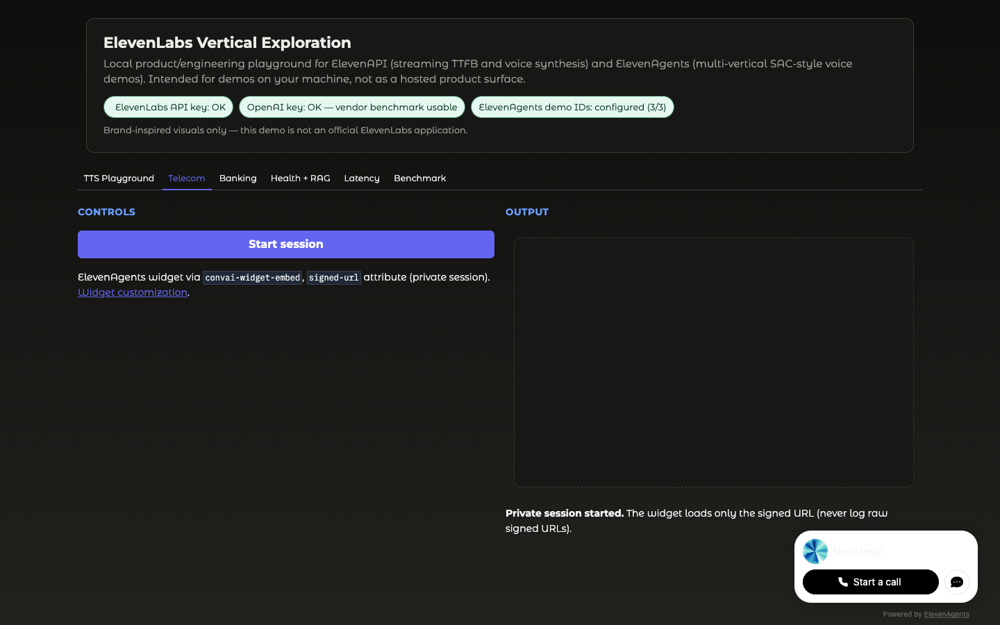
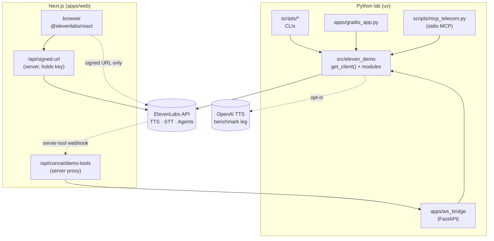

# ElevenLabs agents and API exploration

[](https://github.com/adriannoes/elevenlabs-agents-demo/actions/workflows/ci.yml)

Hands-on lab for **[ElevenAgents](https://elevenlabs.io/docs/eleven-agents/overview)** and **[ElevenAPI](https://elevenlabs.io/docs/api-reference/introduction)**: official SDKs (Python + JS), signed URLs, a small MCP tool server, and three voice scenarios. Built against **public docs only** — useful for reasoning about tools, KB/RAG, retention posture, and how the surfaces fit together. Not a product or a compliance proof.

**Read first:** [Learning experience](product/learning-experience.md) — field notes from integrating as a new developer (docs vs `elevenlabs/skills` vs the live API). Troubleshooting: [pitfalls](docs/pitfalls.md).

The scenario **domain** is Brazilian (telecom SAC, CPF, LGPD, BRL). The **spoken conversation** on the three ElevenAgents tabs is English (`LANGUAGE = "en"`). TTS playground and vendor benchmark still use PT-BR voices and utterances.

Step-by-step path: [end-to-end walkthrough](docs/walkthrough.md). Orientation: [Exploring this repository](docs/exploring-this-repo.md).

---

## What this explores

- **Three agent verticals** — telecom SAC, digital banking (ZRM-minded), healthcare triage + KB/RAG.
- **ElevenAPI** — TTS (sync, HTTP stream, WebSocket), batch and realtime STT, Voice Library helpers, Voice Isolator demo, optional **OpenAI TTS** leg for vendor comparison when `OPENAI_API_KEY` is set.
- **Surfaces** — **Gradio** (full demo), **Next.js** (`elevenlabs/ui` + signed URL, Telecom), **MCP stdio** (`scripts/mcp_telecom.py`), optional **FastAPI** WebSocket TTS bridge under `apps/ws_bridge/`.
- **Docs drift check** — `scripts/skills_model_drift.py` runs regex heuristics: Turbo IDs listed without a deprecation note, and the Scribe keyterm cap.
- **Quality** — typed settings, Pydantic tool schemas, REST retries, pytest (+ VCR integration), ruff, pre-commit (e.g. secret scanning).

---

## Quick start

**Prerequisites:** Python **3.13+** and [`uv`](https://docs.astral.sh/uv/).

```bash
git clone https://github.com/adriannoes/elevenlabs-agents-demo.git
cd elevenlabs-agents-demo
cp .env.example .env
uv sync --extra dev --extra mcp
uv run python scripts/verify_api_keys.py
```

Set `ELEVENLABS_API_KEY` in `.env`. For **ElevenAgents provisioning**, set at least one of:

- **`DEFAULT_AGENT_VOICE_ID`** (recommended) — English or multilingual Voice Library id for the ElevenAgents tabs.
- **`DEFAULT_EN_VOICE_ID`** — English Voice Library id used for Convai when `DEFAULT_AGENT_VOICE_ID` is unset (preferred over PT for English demos).
- **`DEFAULT_PT_VOICE_ID`** — used by the TTS playground, WebSocket bridge, and ElevenLabs vendor benchmark leg; last fallback for agent voice if no agent/EN id is set.

List PT-BR-friendly voices:

```bash
uv run python scripts/voices_pt_br.py
```

If nothing is labelled PT-BR, pick any voice id from the sample output and set `DEFAULT_PT_VOICE_ID` manually. Vendor benchmarking also needs `OPENAI_API_KEY` if you want the OpenAI leg.

---

## Run the demo (Gradio)

**One command:** verify the key, provision all three agents, and write `DEMO_AGENT_ID_*` into `.env` (requires `ELEVENLABS_API_KEY` plus any one of `DEFAULT_AGENT_VOICE_ID`, `DEFAULT_EN_VOICE_ID`, or `DEFAULT_PT_VOICE_ID`):

```bash
uv run python scripts/demo_prepare.py
```

**Manual path** (same outcome; paste printed ids yourself):

```bash
uv run python scripts/agent_create.py telecom
uv run python scripts/agent_create.py banking
uv run python scripts/agent_create.py healthcare
```

```bash
uv run python apps/gradio_app.py
```

Open the URL Gradio prints. Tabs: **TTS Playground**, **Telecom**, **Banking**, **Health + RAG**, **Latency**, **Benchmark** (ElevenLabs vs OpenAI when both keys and `DEFAULT_PT_VOICE_ID` are set for the ElevenLabs leg).



Provisioning detail: [`product/guides/demo-agent-setup.md`](product/guides/demo-agent-setup.md).

---

## Gradio vs `apps/web`

| Surface | Role |
| --- | --- |
| `uv run python apps/gradio_app.py` | Full demo: all three agents, TTS playground, latency, vendor benchmark. Reads `DEMO_AGENT_ID_*` from the **repo** `.env`. |
| `pnpm --dir apps/web dev` | **Next.js** reference: [`elevenlabs/ui`](https://github.com/elevenlabs/ui) + `@elevenlabs/elevenlabs-js` signed URL so the browser never sees `ELEVENLABS_API_KEY`. **Telecom only** — `DEMO_AGENT_ID_TELECOM` in `apps/web/.env.local`. |

Next.js intentionally covers **Telecom only**: it demonstrates the React registry and signed URLs without re-implementing Banking and Healthcare. Reuse the Telecom `agent_id` in `apps/web/.env.local`. Setup: [`apps/web/README.md`](apps/web/README.md).

```bash
cd apps/web
cp .env.example .env.local
pnpm install
pnpm dev
```

Requires Node **20+** and **pnpm**. Same Telecom `agent_id` as Gradio; JS package map is in the [learning experience](product/learning-experience.md#4-three-elevenlabs-js-packages-one-warning-still-easy-to-miss).

---

## MCP (lab tool server)

Stdio server for the telecom mock — not the [hosted ElevenLabs MCP](https://elevenlabs.io/docs/eleven-agents/operate/hosted-mcp). Install the optional extra first (`uv sync --extra mcp`):

```bash
uv run python scripts/mcp_telecom.py
```

Setup: [`docs/mcp-lab-server.md`](docs/mcp-lab-server.md).

---

## Skills vs Models drift

Compare upstream `elevenlabs/skills` copy to canonical Models docs (network; exit 1 on drift, 2 on fetch failure):

```bash
uv run python scripts/skills_model_drift.py
```

Heuristics are line-level (Turbo deprecation notes, Scribe keyterm cap). See [`docs/upstream-skills-notes.md`](docs/upstream-skills-notes.md).

---

## CLI smoke

```bash
uv run python scripts/tts_demo.py "Hello — ElevenLabs real TTS smoke test." --out artifacts/real-tts-smoke.mp3
uv run python scripts/stt_demo.py data/samples/hello-pt-br.mp3
uv run python scripts/tts_stream_ttfb.py --n 10 --model flash
uv run python scripts/voice_isolator_demo.py data/samples/hello-pt-br.mp3 --out artifacts/clean.mp3
uv run python scripts/tts_vendor_benchmark.py --n 1 --out artifacts/benchmarks/tts-vendor-smoke.json
```

These hit the live API and may consume credits. Do not commit secrets or unredacted PII under `artifacts/`.

---

## Scenario write-ups

- [Telecom — customer care](docs/scenarios/telecom.md)
- [Banking — digital banking](docs/scenarios/banking.md)
- [Healthcare — triage](docs/scenarios/healthcare.md)

---

## Repository layout

```text
src/eleven_demo     Library (client, config, TTS, STT, voices, agents, MCP, scenarios, benchmarks, metrics)
apps/gradio_app.py  Primary UI
apps/web/           Next.js + elevenlabs/ui (Telecom, signed URL)
apps/ws_bridge/     Optional FastAPI WebSocket TTS bridge (local)
scripts/            CLIs (provision, simulate, demos, MCP, skills drift, benchmark)
tests/              Unit + VCR integration tests
docs/               Walkthrough, scenarios, benchmarks methodology, technical report, design notes
data/kb/healthcare/  Fictional KB seeds
data/samples/        Sample audio for STT
engineering/        Delivery record, ADRs
product/guides/     Operator-facing agent setup
.cursor/rules/      Cursor rules (SDK, Python, security, tests)
.cursor/skills/     ElevenLabs-focused Cursor skills
```

---

## Architecture

The library `src/eleven_demo` is the single integration point — CLIs, Gradio, the WebSocket bridge, and the lab MCP server import it. Live ElevenLabs access goes through `get_client()` (retries on 429/5xx). The MCP server only wraps local mocks; it does not call the hosted MCP. The Node side mirrors that boundary on its own toolchain: `ELEVENLABS_API_KEY` lives only in `apps/web` server code; the browser receives a short-lived **signed URL** and never sees the key.



Two flows worth calling out:

- **Browser → ElevenLabs** (Next.js): the page calls `/api/signed-url` (server-side, holds the key), gets back a short-lived URL, and opens the conversation directly with ElevenLabs Agents via `@elevenlabs/react`. No key in the client bundle.
- **ElevenLabs → tool webhook** (server tools): when an agent invokes a server tool, Convai POSTs to the public URL configured on the agent. The tunnel routes to `apps/web/api/convai/demo-tools`, which proxies to `apps/ws_bridge`, which dispatches the deterministic mock via `eleven_demo.agents.tool_webhook`. (Direct tunnel to `ws_bridge` works too — see [`apps/web/README.md`](apps/web/README.md).)

`apps/web/` has its own Node toolchain (`pnpm`, `pnpm-lock.yaml`) and sits **outside** Python pre-commit, `uv.lock`, and Python coverage gates. Rationale: [`engineering/architecture/tech-stack-decisions.md`](engineering/architecture/tech-stack-decisions.md).

---

## Further reading

- [Learning experience](product/learning-experience.md) — docs vs skills vs live API
- [Pitfalls](docs/pitfalls.md) — webhook schema, simulate, isolator, voice locale
- [MCP lab server](docs/mcp-lab-server.md)
- [Upstream skills notes](docs/upstream-skills-notes.md) — patch sketches for `elevenlabs/skills`
- [Exploring this repository](docs/exploring-this-repo.md)
- [Extending this lab](docs/extending-this-lab.md)
- [Walkthrough](docs/walkthrough.md)
- [TTS vendor methodology](docs/benchmarks/tts-vendor-comparison.md)
- [Technical exploration report](docs/reports/technical-exploration-report.md)
- [PRD](product/prd/prd-elevenlabs-vertical-exploration.md)

---

## Tests and hygiene

GitHub Actions runs `ruff` plus `pytest -n auto -m "not integration"` on pull requests and on pushes to `main`. That gate does **not** call the live API: there is no API key in CI (`tests/conftest.py` sets a placeholder so Settings loads). Integration tests are excluded by marker and replay locally via VCR:

```bash
uv run pytest -n auto -m "not integration"
uv run pytest -m integration
uv run ruff check .
uv run ruff format --check .
uv run pre-commit run --all-files
```

Integration tests use VCR under `tests/integration/**/cassettes/`: **replay** avoids live calls when the YAML exists; **recording** needs real keys and costs credits. To record scenario + vendor cassettes: `uv run python scripts/record_integration_cassettes.py --provision` (see [`tests/integration/README.md`](tests/integration/README.md)). Never log API keys, `Authorization`, or raw PII.
